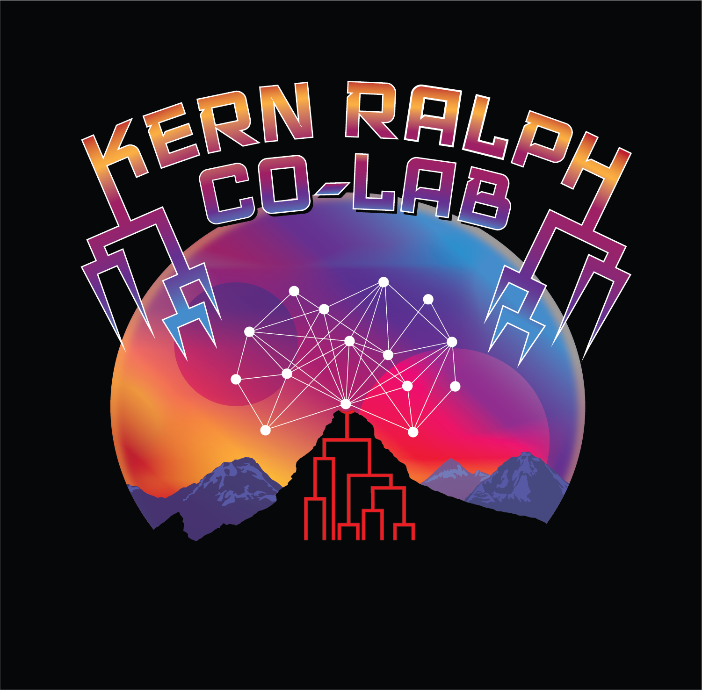

--------------------

<!--
title-slide-attributes:
    data-background-image: /path/to/title_image.png
    data-background-size: contain
-->

> UO is located on the traditional indigenous homeland of the Kalapuya people.
Kalapuya people were dispossessed of their indigenous homeland by the United States government and forcibly removed.
Today, Kalapuya descendants are primarily citizens of the Confederated Tribes of Grand Ronde and the Confederated Tribes of Siletz Indians,
and continue to make important contributions to their communities, to the UO, to Oregon, and to the world.

## Outline of the talk

1. Genomes, and simulations
2. ARGs and the tree sequence (briefly)
3. Applications

*slides:* [github.com/petrelharp/barton-2025](https://petrelharp.github.io/barton-2025/barton-2025.slides.html)

# Introduction

## {data-background-image="figs/dynamics-of-hybrid-zones.png" data-background-position=center data-background-size=100%}

## {data-background-image="figs/bde.png" data-background-position=center data-background-size=100%}

## Thanks, Nick!!

# Spatial population genetics

::: {.caption}
Desert tortoises, courtesy Brad Shaffer and Evan McCartney-Melstad
:::

# Spatial population genetics

## 

::: {.caption}
Desert tortoises, courtesy Brad Shaffer and Evan McCartney-Melstad
:::

## Let's start simpler

::: {.columns}
:::::: {.column width=50%}

::::::
:::::: {.column width=50%}

::::::
:::

# Wright-Malécot

If the population at time $t$ has density $\varphi_t(x)$, and
$$ I_t(x,y) = (\text{proportion identity between $x$ and $y$ at time $t$}) ,
then
$$\begin{aligned}
    I_t(x,y)
    &=
        (1-\mu)^2 \sum_{x',y'} \varphi_{t-1}(x') \varphi_{t-1}(y') I_{t-1}(x',y') p(x',y';x,y)
    \\ &\qquad
        + (1-\mu)^2 \sum_z \varphi_{t-1} q(z;x,y) ,
\end{aligned}$$
where
$$ p(x',y'; x,y) = \mathbb{P}\{\text{parents and $x'$, $y'$ have children that go to $x$, $y$}\}, $$
and
$$ q(z; x,y) = \mathbb{P}\{\text{parent at $z$ has two children that go to $x$, $y$}\}. $$

## Thanks!

:::: {.columns}
:::::::: {.column width=40%}

- Andy Kern
- Nate Pope
- Victoria Caudill
- Murillo Rodrigues 
- Gilia Patterson
- Chris Smith
- Thomas Forest
- Jiseon Min
- Clara Rehmann
- Anastasia Teterina
- Angel Rivera-Colon
<!--
- Bruce Edelman
- Matt Lukac
- Saurabh Belsare
- Gabby Coffing
- Jeff Adrion
- CJ Battey
- Jared Galloway
-->
- the rest of [the Co-Lab](https://kr-colab.github.io/people)

Funding:

- NIH NIGMS
- NSF DBI

::::
:::::::: {.column width=60%}

:::::::::: {.columns}
::::::::::::: {.column width=30%}

- Jerome Kelleher
- Ben Haller
- Yan Wong
- Ben Jeffery
- Sam Tallman
- Duncan Mbuli-Robertson
- Hanbin Lee
- Gregor Gorjanc
- Elsie Chevy
- Madeline Chase
- Sean Stankowski
- Matt Streisfeld
<!--
- Georgia Tsambos
- Jaime Ashander
- Jared Galloway
- Gideon Bradburd
- Bill Cresko
- Alison Etheridge
- Evan McCartney-Melstad
- Brad Shaffer
-->

:::::::::::::
::::::::::::: {.column width=30%}

:::::::::::::
::::::::::

{width=80%}

::::
::::::::

## {data-background-image="figs/guillemots_thanks.png" data-background-position=center data-background-size=50%}
