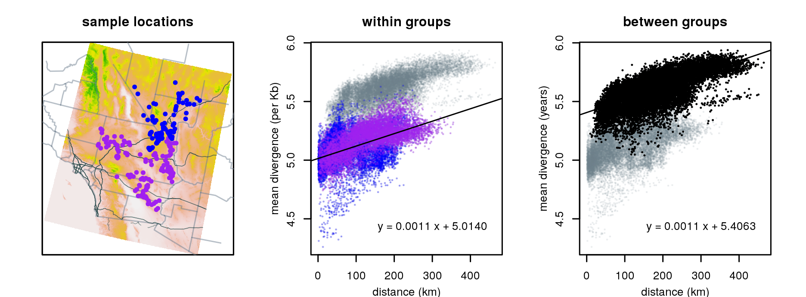
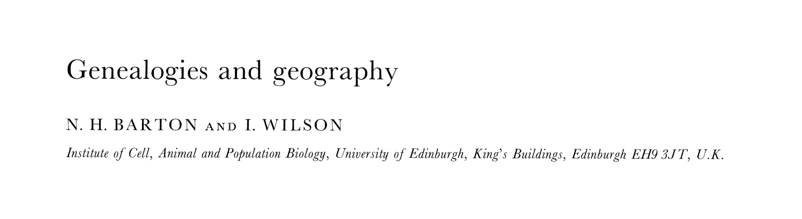
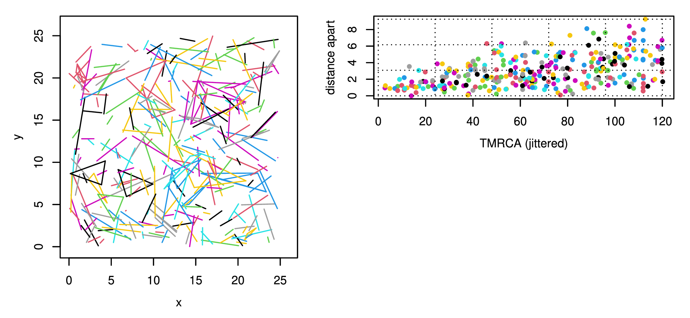

# First, some acknowledgements

<!--
title-slide-attributes:
    data-background-image: /path/to/title_image.png
    data-background-size: contain
-->

> UO is located on the traditional indigenous homeland of the Kalapuya people.
Kalapuya people were dispossessed of their indigenous homeland by the United States government and forcibly removed.
Today, Kalapuya descendants are primarily citizens of the Confederated Tribes of Grand Ronde and the Confederated Tribes of Siletz Indians,
and continue to make important contributions to their communities, to the UO, to Oregon, and to the world.

## {data-background-image="figs/dynamics-of-hybrid-zones.png" data-background-position=center data-background-size=100%}

## {data-background-image="figs/bde.png" data-background-position=center data-background-size=100%}

## Thanks, Nick!!

<!--
Intro to the problem
-->

# {data-background-image="figs/popgen-in-space-new.jpeg" data-background-position=center data-background-size=100%}

::: {.caption .bottomright}
'art' by G. Coop
:::

##

::: {.caption}
Desert tortoises, courtesy Brad Shaffer and Evan McCartney-Melstad
:::

<!--
## 

::: {.caption .bottomright}
Desert tortoises, courtesy Brad Shaffer and Evan McCartney-Melstad
:::
-->

## 

::: {.columns}
:::::: {.column}

Theory:
[*Looking forwards and backwards: Dynamics and genealogies of locally regulated populations*](https://doi.org/10.1214/24-EJP1075)

**Joint work with:**

- Alison Etheridge (Oxford)
- Tom Kurtz (Madison)
- Ian Letter (ex-Oxford)
- Terence Tsui (Warwick)

:::
:::::: {.column width=50%}

:::
::::::

## {data-background-image="figs/forwards-and-backwards.png" data-background-position=center data-background-size=100%}

::: red
Everything here is thanks to Tom Kurtz,

who showed us how to do it.
:::

::: r-stretch

:::

<!--
The population model
-->

# Spatial populations {data-background-image="sims/slim_density_anim.gif" data-background-position=center data-background-size=100%}

## A model {data-background-image="figs/model.png" data-background-position=center data-background-size=100%}

::: {.columns}
:::::: {.column width=50%}

Every individual:

::: incremental
- reproduces at rate $\gamma$
- dies at rate $\mu$
:::

::: fragment
Offspring:

::::: incremental
- disperse with variance $\sigma^2$
- establish with probability $r$
:::::
:::

::: fragment
All this can depend on *location* and *local density*,
measured with a kernel $\rho$:
$$\text{(density at $x$)} = \sum_i \rho(x_i - x).$$
:::

::: fragment
In [EKLRT](https://doi.org/10.1214/24-EJP1075): a *lookdown representation*.
:::

::::::
:::::: {.column width=50%}

::::::
:::

---------

## Population dynamics {data-background-image="figs/model.png" data-background-position=right data-background-size=75%}

::: {.columns}
:::::: {.column width=50%}

The population density $\varphi_t(x)$ at time $t$
(*number* of individuals is $N\varphi(x)$)

::: fragment
if $N$ is large
:::

:::: r-stack

::: {.fragment .coverup}
changes because of *migration*
and *reproduction/death*:
$$\begin{aligned}
    \frac{d}{dt} \varphi_t(x)
    &=
    r(x) \frac{\sigma^2}{2} \Delta (\gamma \varphi_t)(x) \color{white}{+ \varphi_t(x) F(x)}
\end{aligned}$$
:::

::: {.fragment .coverup}
changes because of *migration*
and *reproduction/death*:
$$\begin{aligned}
    \frac{d}{dt} \varphi_t(x)
    &=
    r(x) \frac{\sigma^2}{2} \Delta (\gamma \varphi_t)(x) + \varphi_t(x) F(x) ,
\end{aligned}$$
:::

::::

::: fragment
where
$$\begin{aligned}
    F(x)
    &= \text{(net reproductive output at $x$)} \\
    &= \gamma(x) r(x) - \mu(x) .
\end{aligned}$$
:::

::::::
:::::: {.column width=50%}

::::::
:::

## Forwards: lines of descent {data-background-image="figs/lines_successful.png" data-background-position=right data-background-size=100%}

::: {.columns}
:::::: {.column width=50%}

A *potential* line of descent $Y_t$
diffuses at rate $\sigma^2 \gamma(x)$:
$$dY_t = \sigma^2 \gamma(Y_t) dB_t .$$

::: fragment
The density of *successful* lines of descent
:::
::: fragment
from location $x$ at time $s$ to location $y$ at time $t$
is $h_{s,t}(x,y)$, where
$$\int h_{s,t}(x,y) f(y) dy = \mathbb{E}_x[f(Y_t) e^{\int_s^t F(Y_u) du}],$$
and
$$\begin{aligned}
    F(x)
    &= \text{(net reproductive output at $x$)} \\
    &= \gamma(x) r(x) - \mu(x) .
\end{aligned}$$
:::

::::::
:::::: {.column width=50%}

::::::
:::

## Consistency {data-background-image="figs/lines_successful_all.png" data-background-position=right data-background-size=100%}

::: {.columns}
:::::: {.column width=50%}
The kernel $h_{s,t}(x,y)$ defined by
$$\int h_{s,t}(x,y) f(y) dy = \mathbb{E}_x[f(Y_t) e^{-\int_s^t b(Y_u) du}],$$

is what evolves the density forwards in time:
$$\varphi_t(y) = \int \varphi_s(x) h_{s,t}(x,y) dx .$$

::::::
:::::: {.column width=50%}

::::::
:::

---------

## Backwards: lineages {data-background-image="figs/lines_lineage.png" data-background-position=right data-background-size=100%}

::: {.columns}
:::::: {.column width=65%}

Suppose population has a stationary density $\varphi(x)$. Then
$$ dL_t = r(L_t) \gamma(L_t) 2 \nabla \log(\varphi\gamma)(L_t) dt
+ \sqrt{r(L_t)\gamma(L_t)} dB_t$$

::: incremental
- Lineage speed determined by rate of production of mature offspring
    ($r\gamma$, $\approx$ death),
- and drawn to regions of high total fecundity
    ($\varphi \gamma$).
- Reversible with respect to
$$\color{red}{\pi(x) = \frac{\gamma(x,\varphi(x)) \varphi(x)^2 }{ r(x,\varphi(x))}.} $$
:::

::::::
:::::: {.column width=50%}

::::::
:::

<!--
Close relatives
-->

# Can we *use* this? {data-background-image="sims/slim_density_screenshot_inverted.png" data-background-position=center data-background-size=100%}

::: {.columns}
:::::: {.column width=50%}

<!--

-->

::::::
:::::: {.column width=50%}

::::::
:::

## 

::: {.columns}
:::::: {.column width=50%}

::::::
:::::: {.column width=50%}

::::::
:::

## What about branching? {data-background-image="figs/lines_branching.png" data-background-position=right data-background-size=100%}

These models have *either*

- deterministic population dynamics, or
- finite coalescence time distributions,

**but not both.**

## What about branching? {data-background-image="figs/lines_successful_all_rare.png" data-background-position=right data-background-size=100%}

These models have *either*

- deterministic population dynamics, or
- finite coalescence time distributions,

**but not both.**

## Nonetheless... {data-background-image="figs/lines_branching_rare.png" data-background-position=right data-background-size=100%}

::: {.columns}
:::::: {.column width=50%}

Successful lines of descent *branch*
at rate
$$\begin{aligned}
    \frac{1}{N} c(x) 
    &= \frac{1}{N} \text{(total birth + death rate)} \\
    &= \frac{1}{N} \left( \gamma(x) r(x) + \mu(x) \right)
\end{aligned}$$

::: fragment
and so the density of *close relatives*
at locations $x$ and $y$ and time $t$
from time $s$ is
$$\begin{aligned}
    \frac{1}{N} \int \varphi_s(z) c(z) h_{s,t}(z,x) h_{s,t}(z,y) dz .
\end{aligned}$$
:::

::::::
:::::: {.column width=50%}

::::::
:::

##

Suppose that we've sampled $K$ individuals at time $T$
with intensity $\nu(x)$
and observed close relatives $\{(x_i, y_i, t_i)\}_{i=1}^P$,
with locations $(x_i, y_i)$ and TMRCAs $t_i$.

. . .

How many such pairs do we *expect* to see?

. . .

Well, the intensity of such pairs is
$$\begin{aligned}
w(x,y,t) = \int \varphi_{t}(z) c(z) h_{t,T}(z,x) h_{t,T}(z,y)
\end{aligned}$$

. . .

and so the expected number with $S \le t_i \le T$ is
$$
\frac{K^2}{N} \int_S^T w(x,y,t) \nu(x) \nu(y) dx dy dt .
$$

. . .

*Rare* $\longrightarrow$ Poisson?

## Does it work?

*Simulation:* pairs with an ancestor within 20 generations
in 100 samples from a spatial population
with a total of $10^4$:

::::: r-stack

::: {.fragment .coverup}

:::

::: {.fragment .coverup}

:::

::: {.fragment .coverup}

:::

:::::

# Spatial population genetics?

Takeaways:

- Forwards arguments keep model parameters visible!
- Coalescence and population-scale stochasticity 
    really are two sides of the same coin.

. . .

Moving forwards:

::: incremental
- A likelihood-based way to fit spatially
    heterogeneous population models?
- We do *not* go as far as B&W or BDE!
    More theory needed for patchy/stochastic populations.
- S(L)imulation: see [Chevy et al, *A Guide to Individual-Based Simulations in Continuous Landscapes*](https://onlinelibrary.wiley.com/doi/full/10.1002/ece3.71098)
:::

. . .

**All the thanks** to Nick, Alison, and Tom!

## {data-background-image="figs/guillemots_thanks.png" data-background-position=center data-background-size=50%}

<!--
Wright-Malécot
-->

# Other stuff

## Wright (1943), Malécot (1948)

If the population at time $t$ has density $\varphi_t(x)$,
so that the *number* near $x$ is $N \varphi_t(x)$,
and

$$ I_t(x,y) = (\text{proportion identity between $x$ and $y$ at time $t$}) , $$

then maybe
$$\begin{aligned}
    I_t(x,y)
    &=
        (1-\mu)^2 \sum_{x',y'} \varphi_{t-1}(x') \varphi_{t-1}(y') I_{t-1}(x',y') p_1(x',x) p_1(y',y)
    \\ &\qquad
        + (1-\mu)^2 \frac{1}{N} \sum_z \varphi_{t-1}(z) p_1(z,x) p_1(z,y) (1 - I_{t-1}(z,z)),
\end{aligned}$$
where dispersal is
$$ p_1(z,x) = \mathbb{P}\{\text{offspring from $z$ goes to $x$}\} . $$

::: {.caption}
better explanations: XXX
:::

## Backwards

$$\begin{aligned}
    I_t(x,y)
    &=
        (1-\mu)^2 \sum_{x',y'} \varphi_{t-1}(x') \varphi_{t-1}(y') I_{t-1}(x',y') p_1(x',x) p_1(y',y)
    \\ &\qquad
        + (1-\mu)^2 \frac{1}{N} \sum_z \varphi_{t-1}(z) p_1(z,x) p_1(z,y) (1 - I_{t-1}(z,z))
\end{aligned}$$

Two individuals today are identical if

- their parents were distinct and identical
- or they are siblings,
- and neither got a new mutation.

## Forwards

$$\begin{aligned}
    I_{t+1}(x,y)
    &=(1-\mu)^2 \sum_{x',y'} \varphi_{t}(x') \varphi_{t}(y') I_{t}(x',y') p_1(x',x) p_1(y',y)
    \\ &\qquad
        + (1-\mu)^2 \frac{1}{N} \sum_z \varphi_{t}(z) p_1(z,x) p_1(z,y) (1 - I_{t}(z,z))
\end{aligned}$$

In the next generation, those who are identical

- have distinct and identical parents,
- or are siblings,
- except for when new mutation intevenes.

## A solution

At stationary, and in continuous time,
we get
$$\begin{aligned}
    \frac{\sigma^2}{2} (\Delta_x + \Delta_y) I_t(x,y) - 2 \mu I(x,y)
    &= - \frac{1}{N} \delta_0(x-y) (1 - I(x,y)) .
\end{aligned}$$

The solution is
$$\begin{aligned}
    \frac{I(x,y)}{1 - I(XXX)}
    &= \frac{1}{N} \int_0^\infty \int e^{-2 \mu t} \varphi_t(z) p_t(z,x) p_t(z,y) dz dt .
\end{aligned}$$

Interpretation: sum over all coalescence times.

Solution, in $\mathbb{R}^2$:
$$ I(x,y) = K_0(xyz) . $$

:tada:

<!--
Difficulties
-->

## Difficulties

1. What is $N$?
2. Um but $K_0(0) = \infty$?
3. Offspring don't move independently, especially successful ones.

## What's really going on?

Let $\tau_{xy}$ be the TMRCA of samples at $x$ and $y$,
so that $I(x,y) = \mathbb{E}[e^{-2\mu t} \tau_{xy}]$,

and
$$\begin{aligned}
     n_s(z;x,y) &= (\text{number of pairs at $x,y$} \\
            &\qquad \text{whose MRCA is at $z$, time $s$ ago}) .
\end{aligned}$$

Then
$$\begin{aligned}
    \mathbb{P}\{ \tau_{xy} \le t \}
    = \frac{ \int_0^t \int n_s(z;x,y) dz ds }
           { \int_0^\infty \int n_s(z;x,y) dz ds } .
\end{aligned}$$

We want
$$ n_s(z;x,y) = C p_s(z,x) p_s(z,y) , $$
with $C$ a constant (local birth rate).

## The problem

We want

1. $n_s(z;x,y) = C p_s(z,x) p_s(z,y)$, with $C$ a constant, and
2. $\int_0^\infty \int n_s(z;x,y) dz ds < \infty$.

. . .

[EKLRT](https://dx.doi.org/10.1214/24-EJP1075)
showed that these are contradictory*.

More generally: continuous spatial population models* can either have

1. finite coalescent time distributions, or
2. be deterministic,

but not both.

. . .

::: {.caption}
*${}^*$some terms and conditions may apply*
:::

## Open question

There is nonetheless an expression for $I$ in $d=1$;
how do you get this out of the 
[EKLRT](https://dx.doi.org/10.1214/24-EJP1075) model?

